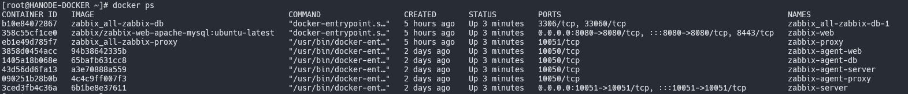

## Projeto Docker Zabbix Completo com Particionamento e Manutenção - Oracle Linux 9 - Zabbix 7.0.5

Este projeto utiliza contêineres Docker para configurar e gerenciar o ambiente Zabbix com suporte a particionamento de banco de dados e scripts de manutenção automatizada. É ideal para quem busca uma solução completa de monitoramento com configuração e manutenção simplificadas.

## Estrutura do Projeto

A estrutura de arquivos e diretórios do projeto é organizada da seguinte forma:

* **Grafana-Dockerfile**
  * `.env`: Arquivo de variáveis de ambiente para configuração do Grafana.
  * `docker-compose.yml`: Arquivo de configuração Docker Compose para o Grafana.
  * `Dockerfile.Grafana`: Dockerfile para a criação da imagem do Grafana com plugins personalizados.
* **Install_Docker**
  * `docker_install.sh`: Script para instalação e configuração inicial do Docker no host.
* **maintenance_tools**
  * `remove_container.sh`: Script para remover contêineres e volumes.
  * `run_partition_maintenance.sh`: Script para manutenção das partições do banco de dados.
* **monitoring_Sintetico**
  * `.env`: Arquivo de variáveis de ambiente para configuração dos serviços de monitoramento sintético.
  * `backup`: Diretório para armazenamento de backups de configuração e dados.
  * `docker-compose.yml`: Arquivo de configuração Docker Compose para os serviços de monitoramento sintético.
* **Arquivos de Configuração do Zabbix**
  * `cron_partition.sh`: Script para configurar o cron para particionamento do banco de dados.
  * `docker-compose.yml`: Arquivo de configuração principal do Docker Compose para o Zabbix.
  * `Dockerfile.mysql`: Dockerfile para o contêiner MySQL.
  * `Dockerfile.zabbix-agent`: Dockerfile para o agente Zabbix.
  * `Dockerfile.zabbix-partition`: Dockerfile para o servidor Zabbix com suporte a particionamento.
  * `Dockerfile.zabbix-proxy`: Dockerfile para o proxy do Zabbix.
  * `Dockerfile.zabbix-server`: Dockerfile para o servidor Zabbix.
  * `my.cnf`: Arquivo de configuração do MySQL.
  * `part.sql`: Script SQL para configuração inicial do banco de dados.
  * `setup_zabbix.sh`: Script para configuração inicial do Zabbix.
* **README.md**: Documentação do projeto, com instruções de uso e configuração.

## Contêineres Utilizados

* **zabbix-db**: Banco de dados MySQL para o Zabbix.
* **zabbix-server**: Servidor principal do Zabbix.
* **zabbix-web**: Interface web do Zabbix, rodando com Apache e MySQL.
* **zabbix-proxy**: Proxy para o Zabbix, usado para monitoramento distribuído.
* **zabbix-agent-web**: Agente Zabbix para monitoramento da interface web.
* **zabbix-agent-server**: Agente Zabbix para monitoramento do servidor principal.
* **zabbix-agent-db**: Agente Zabbix para monitoramento do banco de dados.

## Pré-requisitos

* Docker e Docker Compose instalados.
* Git para clonar o repositório, se necessário.
* **docker_install.sh** : Script para instalação docker e docker-compose, Pasta Install_Docker.

## Como Usar

### Passo 1: Clonar o Repositório

Clone o repositório para o seu ambiente local:

```bash
git clone https://github.com/marioalvesluck/docker_zabbix_partition.git
cd zabbix-monitoring-docker-partition
```

### Passo 2: Configurar Variáveis de Ambiente

Certifique-se de definir as variáveis de ambiente no arquivo `.env` para personalizar as credenciais e configurações do MySQL e do Zabbix:

### Tempo de Retenção dos Dados : part.sql configurar de acordo sua Politica de Retençao de Dados

## Configurações Zabbix .env

```plaintext
MYSQL_ROOT_PASSWORD=Zabbix2024!
MYSQL_DATABASE=zabbix
MYSQL_USER=zabbix
MYSQL_PASSWORD=Serverzabbix!
PHP_TZ=America/Sao_Paulo
ZBX_SERVER_HOST=zabbix-server
ZBX_PROXY_HOSTNAME=NodeProxy1
ZBX_SRV_PRIMARY_TLSPSKIDENTITY=zabbix-server-primary
ZBX_PROXY_TLSPSKIDENTITY=NodeProxy1
ZBX_HANODENAME=Node1
```

O projeto utiliza particionamento para gerenciar o tempo de retenção dos dados nas tabelas do banco de dados Zabbix. A retenção é configurada nos procedimentos armazenados para que as tabelas mais volumosas mantenham apenas os dados necessários, reduzindo o tamanho do banco de dados e melhorando o desempenho.

As tabelas principais e o tempo de retenção configurado para cada uma são os seguintes:

* **Tabelas de Histórico** (`history`, `history_log`, `history_str`, `history_text`, `history_uint`):
  * **Tempo de Retenção** : 60 dias
  * **Intervalo de Partição** : 24 horas
  * **Próximas Partições Criadas** : 10 intervalos futuros
  * **Descrição** : Essas tabelas armazenam dados de histórico detalhado do Zabbix. Cada tabela é particionada por dia e mantém apenas os dados dos últimos 60 dias. A cada manutenção, novas partições são criadas para os próximos 10 dias, enquanto partições mais antigas que 60 dias são removidas.
* **Tabelas de Tendências** (`trends`, `trends_uint`):
  * **Tempo de Retenção** : 365 dias
  * **Intervalo de Partição** : 24 horas
  * **Próximas Partições Criadas** : 10 intervalos futuros
  * **Descrição** : Essas tabelas armazenam dados de tendências agregadas, que geralmente são úteis para análises de longo prazo. Cada partição representa um dia e os dados são mantidos por até um ano (365 dias). A manutenção cria partições para os próximos 10 dias e remove partições mais antigas que um ano.

### Passo 3: Configuração Inicial do Zabbix

Execute o script `setup_zabbix.sh` para realizar a configuração inicial do Zabbix:

chmod +x  setup_zabbix.sh

./setup_zabbix.sh ou bash setup_zabbix.sh

### Passo 4: Verifique o status dos contêineres

docker ps

### Passo 5: Acessa Frontend do Zabbix : Acessar com Seu Endereço Local

Exe: http://192.168.0.250:8080/

http://x.x.x.x:8080/

### Passo 6: Verifique os IPS, Passando NAMES

docker inspect -f '{{range .NetworkSettings.Networks}}{{.IPAddress}}{{end}}' **zabbix-proxy**



### Passo 7: Executar Manualmente Tarefa Particionamento

**Obs: Verifica NAMES do zabbix_all-zabbix-db-1 , Ajustar no comando abaixo.**

docker exec -it zabbix-monitoring-docker-partition-zabbix-db-1 bash /etc/cron.daily/partition_maintenance

### Passo 8: Verificar Logs do Particionamento .

docker exec -it zabbix-monitoring-docker-partition-zabbix-db-1 cat /var/log/zabbix_partition_maintenance.log

### Passo 9: Verificar Tabelas de Particionamento Particionamento .

Obs: Senha esta no Aruivo **(.env)**

**Comando** : Após executar esse comando, você verá uma lista de tabelas com informações de particionamento. Se não houver nenhuma linha retornada, significa que não há tabelas particionadas no banco `zabbix`. Caso contrário, o resultado mostrará cada tabela com suas partições e métodos de particionamento

docker exec -it zabbix-monitoring-docker-partition-zabbix-db-1 mysql -u root -pZabbix2024! -e "
SELECT
    TABLE_NAME,
    PARTITION_NAME,
    SUBPARTITION_NAME,
    PARTITION_ORDINAL_POSITION,
    PARTITION_METHOD,
    SUBPARTITION_METHOD,
    PARTITION_EXPRESSION
FROM
    information_schema.PARTITIONS
WHERE
    TABLE_SCHEMA = 'zabbix'
    AND PARTITION_NAME IS NOT NULL;
"

## Importar Hosts no Zabbix

Este projeto inclui hosts prontos para serem importados no ambiente Zabbix. Para realizar a importação, siga o procedimento abaixo:

1. Acesse o  **Frontend do Zabbix** .
2. Navegue até  **Configuração > Hosts** .
3. No canto superior direito, clique em  **Importar** .
4. Localize o arquivo de hosts a ser importado e faça o upload.

Após a importação, os hosts estarão configurados e prontos para monitoramento no Zabbix.

## Cadastrar Proxy no Frontend do Zabbix

Este projeto também inclui a configuração de uma chave PSK (Pre-Shared Key) para o proxy do Zabbix, garantindo uma conexão segura entre o proxy e o servidor. Siga os passos abaixo para cadastrar o proxy no Zabbix:

### 1. Obtenha a Chave PSK do Proxy

Para registrar a chave PSK que será utilizada no cadastro do proxy, execute o seguinte comando no terminal:

cat /var/lib/zabbix/zabbix-proxy/enc/zabbix_proxy.psk

Guarde o valor exibido, pois ele será necessário para configurar a criptografia no próximo passo.

### 2. Cadastrar o Proxy no Zabbix

1. No  **Frontend do Zabbix** , acesse  **Administração > Proxies** .
2. Clique em  **Criar Proxy** .
3. Preencha as informações básicas do proxy:
   * **Nome do Proxy** : Insira o nome do proxy conforme configuado no arquivo `.env` (exemplo: `NodeProxy1`).
   * **Endereço do Proxy** : Defina o endereço IP do proxy conforme especificado no `docker-compose.yml` (exemplo: `172.18.0.13`).
4. Na parte superior, vá para a aba  **Criptografia** .
5. Configure a criptografia PSK:
   * Em  **Conexões do proxy** , selecione  **PSK** .
   * **Identidade PSK** : Insira o valor `NodeProxy1` (ou o valor configurado em `.env` para `ZBX_PROXY_TLSPSKIDENTITY`).
   * **Chave PSK** : Cole o valor da chave PSK coletado anteriormente.
6. Clique em **Adicionar** para salvar o proxy.

Após esses passos, o proxy será cadastrado e autenticado com o servidor Zabbix usando criptografia PSK, garantindo uma conexão segura.

---

Essas instruções detalham o processo de forma mais clara, organizada e direcionada, facilitando a configuração do proxy e a importação de hosts no ambiente Zabbix.

## Manutenção e Particionamento

Este projeto inclui scripts para realizar manutenção e particionamento automático no banco de dados, garantindo que o Zabbix continue a operar com eficiência.

### Scripts de Manutenção

* **setup_zabbix.sh** : Script para configuração inicial do Zabbix e instalação Completa dos containers Zabbix.
* **run_partition_maintenance.sh** : Executa a manutenção de particionamento no banco de dados. Recomendado para ser configurado no cron para rodar periodicamente.
* **remove_container.sh** : Script para remover contêineres, imagens, volumes e redes personalizadas, usado para limpeza completa do ambiente.
* **backup_mysql.sh** : Script para realizar backups, Cria um backup completo do banco de dados e o compactado,Faz backup apenas das configurações (hosts, etc.) do Zabbix.

### Exemplo de Configuração de Cron

**Obs:** Ambiente ja Obtém da manutenção rodando diariamente 00:00 todo dia , arquivo Dockerfile.yml

Você pode configurar o `run_partition_maintenance.sh` para rodar diariamente usando o `cron`. Adicione a seguinte linha ao `crontab`:

0 0 * * * /caminho/para/o/script/run_partition_maintenance.sh

Isso configurará o script para rodar todos os dias às 0h , executando a manutenção de particionamento no banco de dados.

## Comandos Úteis

Aqui estão alguns comandos úteis para gerenciar os contêineres do projeto:

**Parar e remover contêineres** :

    docker-compose down

**Reiniciar contêineres** :

    docker-compose restart / docker restart containeID ou nome_container

**Ver logs dos contêineres** :

   docker logs -f containeID ou nome_container / docker-compose logs -f

## Configuração do Banco de Dados

O contêiner `zabbix-db` utiliza o MySQL como banco de dados. O arquivo `my.cnf` é montado no contêiner e permite configurar o fuso horário, charset e outras opções do MySQL.

### Configuração do Grafana

O projeto também inclui um contêiner Grafana, configurado para fornecer visualizações e painéis de monitoramento. A imagem usada permite a instalação de plugins adicionais para ampliar a funcionalidade do Grafana.

#### Instruções para Subir o Contêiner Grafana

 **Configuração Inicial** : Verifique se o arquivo `.env` está configurado com o fuso horário desejado (`TZ`) e outras variáveis, como as credenciais padrão para o Grafana.

 **Iniciar o Contêiner** :

* Para iniciar o contêiner Grafana com o Docker Compose, use o comando: **docker-compose up -d**

 **Verificar o Status** :

* Para garantir que o contêiner está em execução, você pode listar os contêineres ativos: **docker ps**

 **Acessar o Grafana** :

* No navegador, acesse o Grafana através do endereço: **http://localhost:3000**
* As credenciais de login padrão (configuradas no arquivo `.env`) são:

  * **Usuário** : `admin`
  * **Senha** : `admin`
* É recomendável alterar a senha padrão no primeiro login.

 **Personalização e Plugins** :

* O `Dockerfile` está configurado para instalar vários plugins úteis, incluindo painéis e integrações com o Zabbix. Para adicionar novos plugins, atualize o Dockerfile e reconstrua a imagem com: **docker-compose build grafana**

#### Observações para o Grafana

* **Persistência de Dados** : O volume `/var/lib/grafana` é usado para armazenar os dados do Grafana, garantindo que configurações e dashboards persistam mesmo após reinicializações.
* **Logs** : Os logs do Grafana são armazenados em `/var/log/grafana`, permitindo monitorar o desempenho e erros.
* **Backup Regular** : Para ambientes de produção, é altamente recomendável configurar backups regulares dos dados do Grafana para evitar perda de configurações e dashboards.
* **Personalização via `.env`** : As principais configurações do Grafana podem ser ajustadas no arquivo `.env` para facilitar a personalização.

### Instruções para Executar Selenium com varias Instâncias de navegador

**Personalização via `.env`** : As principais configurações do Monitoramento Sintético podem ser ajustadas no arquivo `.env` para facilitar a personalização.

1. Navegue até a pasta `monitoring_sintetico` onde está o `docker-compose.yml`.
2. Execute o comando para iniciar os contêineres em segundo plano: **docker-compose up -d**
3. **docker-compose.yml - Principal do Projeto container zabbix-server: ZBX_WEBDRIVERURL: "http://localhost:4444"** , pode alterar Endereço para sua Estrutura.

**Esse setup permitirá que você utilize o Selenium Grid para testes automatizados com várias instâncias de navegador.**

### Observações

- **Homologação**: Este projeto foi testado em um ambiente de homologação com Oracle Linux 9, garantindo compatibilidade e desempenho estável.
- **Manutenção Automática do Banco de Dados**: O script `run_partition_maintenance.sh` está configurado para executar automaticamente todos os dias à meia-noite. Esse processo garante o bom desempenho do banco de dados ao gerenciar as partições de maneira eficiente. Caso deseje realizar essa manutenção manualmente ou no host fora dos contêineres, o script pode ser configurado no cron do sistema.
- **Personalização**: Todas as configurações importantes (credenciais, hosts, etc.) estão centralizadas no arquivo `.env`, facilitando personalizações e ajustes.
- **Backup Regular**: Para ambientes de produção, recomenda-se configurar backups regulares do banco de dados para evitar a perda de dados críticos.

## Contribuição

Sinta-se à vontade para contribuir com melhorias para este projeto. Para fazer isso:

1. Faça um fork do repositório.
2. Crie uma nova branch com sua funcionalidade: `git checkout -b minha-funcionalidade`.
3. Commit suas alterações: `git commit -am 'Adicionei nova funcionalidade'`.
4. Faça o push para a branch: `git push origin minha-funcionalidade`.
5. Abra um Pull Request.

## Licença

Este projeto é licenciado sob a licença MIT. Consulte o arquivo LICENSE para mais informações.
